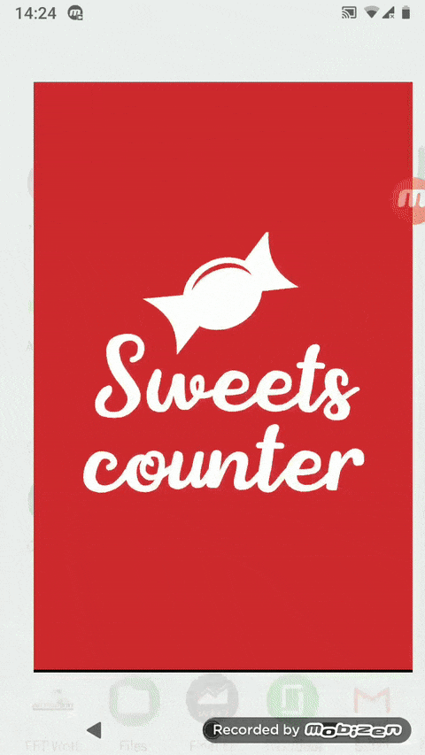

# Sweets counter
Android app created with MVVM, Android Architecture Components and other modern tech-stack. The first article on Clean Architecture where this project was used can be found [in this post][article].

## User flow

 ## Tech-stack used:
 * Language - Kotlin
 * Architecture - MVVM + Clean
 * Connecting stuff, reactivity and background work — Android Architecture Components + RxJava (Paging Library, Data binding, ViewModel, LiveData, Work Manager, Navigation)
 * Database - ObjectBox
 * Networking - Retrofit 2
 * Json converter - Moshi
 * Dependency Injection - Dagger 2
 
 Ui libs:
 * Bottom navigation bar - [Morph Bottom Navigation][bottom]
 * Charts - [MPAndroidChart][charts]
 * Sticky RecyclerView - [SimpleRecyclerView][recycler]
 * Number ticker - [Ticker][ticker]
 
 Testing:
 
 Mockito, Espresso, DaggerMock, LeakCanary, KtLint (linter for Kotlin), CrashLytics, Firebase Perf,
 
 ## Credits
 * To creators of used libs
 * Tautvydas Strioga for external db and APIs
 * These articles for inspiration: 
 
 https://proandroiddev.com/a-guided-tour-inside-a-clean-architecture-code-base-48bb5cc9fc97
 
 https://medium.com/@fivenyc/android-architecture-part-1-every-new-beginning-is-hard-132a65507f48
 
 [article]: https://proandroiddev.com/a-quest-for-comfy-android-app-architecture-pt-1-the-project-7fe7418303ff
 [bottom]: https://github.com/tommybuonomo/morph-bottom-navigation
 [charts]: https://github.com/PhilJay/MPAndroidChart
 [recycler]: https://github.com/jaychang0917/SimpleRecyclerView
 [ticker]: https://github.com/robinhood/ticker
